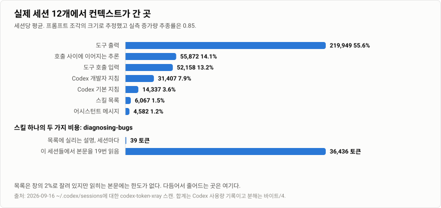

[English](./README.md) | **한국어**

# codex-token-xray

무엇을 줄이기 전에 Codex 컨텍스트 토큰이 어디로 가는지부터 봅니다.

Codex는 세션마다 로그를 남깁니다. 모델에 무엇을 보냈고 호출마다 얼마가 들었는지
그대로 적혀 있습니다. codex-token-xray는 그 로그를 읽어서 컨텍스트를 잡아먹는
부분을 순위로 보여줍니다. 그다음 파일로 고칠 수 있는 부분만 다듬습니다.

## 설치

```bash
npx skills add Seokwoooo/codex-token-xray
```

설치가 끝나면 Codex에서 실행합니다.

```text
$codex-token-xray
```

모든 프로젝트에서 쓰려면 플래그 하나만 붙입니다.

```bash
npx skills add Seokwoooo/codex-token-xray -g
```

Python 3.9 이상이면 됩니다. 별도 패키지도 네트워크도 필요 없습니다.

## 어떤 결과가 나오나

한 컴퓨터의 실제 세션 12개를 스캔한 결과입니다.

```text
Sessions    12 parsed from ~/.codex | models gpt-5.6-luna, gpt-5.6-sol, gpt-6-astra
Measured    sum over 2,552 model calls: input 325,526,989 | cached 315,016,960 | net new 10,510,029 | output 1,594,600 (reasoning 670,471)
            peak context median 210,429 tokens | 22 compactions
Startup     33,469 tokens before any work (median of 3 fresh sessions)
            base 5,318 | developer 13,527 (app-context 11,992) | skills catalog 5,879 | unattributed 13,710
Where it goes (estimated by size, per session average)
              219,949   55.6%  tool outputs
               55,872   14.1%  reasoning carried between calls (measured)
               52,158   13.2%  tool call inputs
               31,407    7.9%  Codex developer instructions
               14,337    3.6%  Codex base instructions
                6,067    1.5%  skills catalog
            estimate tracks measured growth at 0.848 (range 0.471..1.026) over 34 windows
Catalog     64 skills | 5,234 tokens in prompt | budget 5,440 tokens (95% used, 0 cut)
            editable descriptions 28 = 1,566 tokens | native 36 = 2,406 tokens (never edited)
Skill bodies read in these sessions
               36,436  diagnosing-bugs | 19x | editable
               31,608  sites-building | 6x | native
               12,545  imagegen | 3x | native
               11,771  firecrawl | 3x | editable
               11,351  motion | 4x | editable
Largest tool output 16,539 tokens | exec | sed -n '32,285p' .../mascot.js
            Codex already truncated 48 outputs (original 5,577,685 tokens)
Trim        10 descriptions | 16 skill bodies | 0 AGENTS.md files worth a look
```



대부분의 컴퓨터에서 두 가지가 눈에 띕니다. 도구 출력이 컨텍스트의 절반을
넘습니다. 그리고 스킬 목록 자체는 작은데 반복해서 읽히는 스킬 본문이 큽니다.
위에서 한 스킬은 19번 읽히면서 36,436토큰을 썼습니다. 그 스킬의 설명은
세션당 39토큰입니다.

## 실측과 추정

토큰 합계는 Codex가 모델 응답마다 남기는 사용량 기록에서 가져옵니다. 실제로
청구된 숫자입니다. 항목별 분해는 같은 로그에 남은 프롬프트 조각의 크기로
추정합니다. 보고서에는 그 추정이 실측 증가량을 얼마나 따라갔는지가 함께
적힙니다. 위 컴퓨터에서는 0.85였습니다. 두 숫자는 늘 나란히 놓이고 서로를
대신하지 않습니다.

시작 줄에는 unattributed 항목이 있습니다. Codex가 로그에 쓰지 않는 프롬프트
내용이며 도구 스키마가 여기에 들어갑니다. 줄일 수 없는 부분이고 줄일 수 있다고
말하지도 않습니다.

## 무엇을 다듬나

파일만 다듬습니다. 스캔은 세 종류의 후보를 냅니다.

- 세션마다 목록에 실리는 스킬 설명
- 실제 세션에서 읽혔고 길이가 긴 스킬 본문
- 프로젝트에서 Codex가 불러오는 AGENTS.md

스킬 본문은 OpenAI가 권장하는 방식 그대로입니다. 매번 필요한 내용만 SKILL.md에
남기고 나머지는 본문이 가리키는 `references/` 파일로 옮깁니다. 지우는 것은
없습니다. Codex는 조건이 맞을 때만 그 파일을 읽습니다.

인기 있는 설치형 스킬도 대상입니다. Playwright나 Superpowers도 세션에서 계속
읽히는 스킬이라면 다듬을 수 있습니다. 그 스킬을 다시 설치하거나 업데이트하면
수정본은 덮어써집니다. 백업이 원본 바이트를 그대로 갖고 있고 보고서는 그런
스킬을 보여줄 때마다 이 사실을 다시 말합니다.

모든 수정은 계획 파일을 거칩니다. 도우미가 diff를 먼저 보여주고 검토 뒤에
해시가 바뀐 파일은 건드리지 않습니다. 승인하면 검증된 zip 백업을 만든 뒤에
씁니다. 쓰다가 실패하면 쓴 것만 되돌립니다. `restore.py`는 백업 이후에 추가된
작업을 발견하면 멈춥니다.

## 절대 건드리지 않는 것

Codex 네이티브 스킬입니다. 기본 제공 `.system` 스킬과 플러그인 캐시와 관리자
스킬, 그리고 사용자 폴더에 복사된 사본과 OpenAI 저작권 표시가 있는 파일까지
포함합니다. computer-use와 sites와 imagegen과 openai-docs 같은 스킬은 출고
상태 그대로 둡니다. 계획 파일에 적혀 있어도 도우미가 거부합니다.

모델과 effort와 승인 설정과 샌드박스와 훅과 MCP와 자격 증명도 그대로 둡니다.
스킬을 끄거나 옮기거나 이름을 바꾸지 않습니다. 보고서와 백업은
`~/.codex-token-xray` 아래에만 둡니다.

## 솔직한 한계

도구 출력은 파일이 아니라 습관입니다. 보고서는 가장 큰 출력과 한 세션에서
여러 번 읽힌 파일을 보여줍니다. 파일 전체 대신 줄 범위와 `rg`로 읽는 것이
해결책이고 그건 패치가 아니라 습관입니다.

스킬 목록은 Codex가 컨텍스트 창의 2퍼센트로 잘라 둡니다. 설명을 줄이면 목록이
그 한도 아래에 있을 때만 비용이 내려갑니다. 한도를 넘긴 상태라면 설명이
잘리는 것을 막아줄 뿐입니다.

다듬은 효과는 수정 뒤에 시작한 세션부터 나타납니다. 보고서는 이 말을 매번
합니다. 세션 몇 개를 더 돌린 뒤 다시 스캔해서 비교하면 됩니다.

## astra-xray

[astra-xray](https://github.com/Seokwoooo/astra-xray)는 Codex 환경을 GPT-6 Astra에
맞게 정리합니다. 이 도구는 모델과 상관없이 다른 질문에 답합니다. 토큰이 어디로
가는가. 두 도구는 Codex 0.154.0의 예산 계산과 백업 형식을 공유합니다.

## 스캐너만 바로 실행

```bash
python3 .agents/skills/codex-token-xray/scripts/xray.py
```

현재 폴더에서 시작한 세션만 보려면 `--project`를 붙입니다. Windows에서는
`python3` 대신 `py -3` 또는 `python`을 씁니다.

## 개발

```bash
python3 -m unittest discover -s tests
```

## 라이선스

MIT
