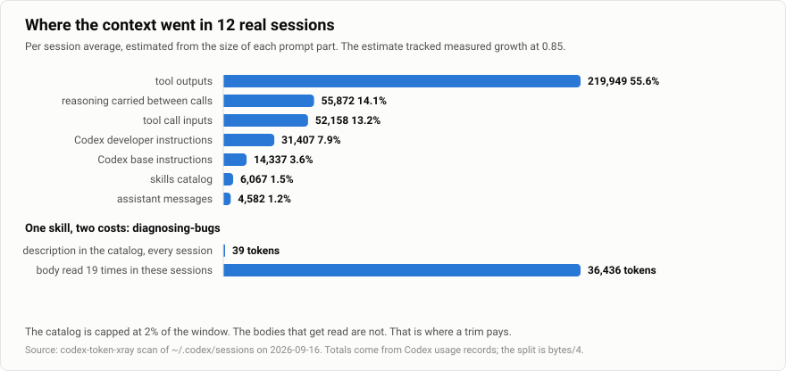

**English** | [한국어](./README.ko.md)

# codex-token-xray

See where your Codex context tokens go before you trim anything.

Codex writes a log for every session. It records what the model was sent and what
each call cost. codex-token-xray reads those logs and shows which parts of the
context are eating your window. Then it trims the parts that are files.

## Install

```bash
npx skills add Seokwoooo/codex-token-xray
```

Then in Codex:

```text
$codex-token-xray
```

Want it in every project? Add one flag:

```bash
npx skills add Seokwoooo/codex-token-xray -g
```

Python 3.9 or newer. No Python packages. No network.

## What you get

This is a scan of twelve real sessions on one machine:

```text
Sessions    12 parsed from ~/.codex | models gpt-5.6-luna, gpt-5.6-sol, gpt-6-astra
Measured    sum over 2,552 model calls: input 325,526,989 | cached 315,016,960 | net new 10,510,029 | output 1,594,600 (reasoning 670,471)
            peak context median 210,429 tokens | 22 compactions
Startup     33,469 tokens before any work (median of 3 fresh sessions)
            base 5,318 | developer 13,527 (app-context 11,992) | skills catalog 5,879 | unattributed 13,710
Where it goes (estimated by size, per session average)
              219,949   55.6%  tool outputs
               55,872   14.1%  reasoning carried between calls (measured)
               52,158   13.2%  tool call inputs
               31,407    7.9%  Codex developer instructions
               14,337    3.6%  Codex base instructions
                6,067    1.5%  skills catalog
            estimate tracks measured growth at 0.848 (range 0.471..1.026) over 34 windows
Catalog     64 skills | 5,234 tokens in prompt | budget 5,440 tokens (95% used, 0 cut)
            editable descriptions 28 = 1,566 tokens | native 36 = 2,406 tokens (never edited)
Skill bodies read in these sessions
               36,436  diagnosing-bugs | 19x | editable
               31,608  sites-building | 6x | native
               12,545  imagegen | 3x | native
               11,771  firecrawl | 3x | editable
               11,351  motion | 4x | editable
Largest tool output 16,539 tokens | exec | sed -n '32,285p' .../mascot.js
            Codex already truncated 48 outputs (original 5,577,685 tokens)
Trim        10 descriptions | 16 skill bodies | 0 AGENTS.md files worth a look
```



Two things stand out on most machines. Tool outputs take more than half of the
context. And the skills catalog is small next to the skill bodies that get read
over and over. One skill above cost 36,436 tokens in nineteen reads. Its
description costs 39 tokens per session.

## Measured or estimated

The token totals come from the usage records Codex writes after every model
response. They are the numbers you were billed for. The breakdown by category is
estimated from the size of each prompt part in the same log. The report says how
well the estimate tracked the measured growth of the context. On the machine
above it was 0.85. Both numbers sit next to each other in every report. Neither
pretends to be the other.

The startup line has an unattributed part. That is prompt content Codex never
writes to the log. Tool schemas live there. You cannot trim it and the tool does
not claim you can.

## What it trims

Only files. The scan lists three kinds of candidates.

- Skill descriptions that sit in the catalog every session
- Skill bodies that were actually read in your sessions and run long
- AGENTS.md files that Codex loads for the project

For skill bodies the pattern is the one OpenAI recommends: keep what every run
needs in SKILL.md and move the rest into `references/` files the body points to.
Nothing gets deleted. Codex reads the reference only when the condition is met.

Popular installed skills are in scope. Playwright or Superpowers can be trimmed
if they are what your sessions keep reading. A reinstall or update of that skill
will overwrite the edit. The backup keeps the original bytes and the report says
so every time it lists one.

Every edit goes through a plan file. The helper previews the diff and refuses to
touch a file whose hash changed since you reviewed it. When you approve it makes
a verified zip backup and writes. If a write fails it rolls back what it wrote.
`restore.py` puts things back and stops if it finds work added after the backup.

## What it never touches

Codex native skills. That means the bundled `.system` skills, plugin caches and
admin skills, plus copies of them under your own folders and anything with an
OpenAI copyright notice. Skills like computer-use and sites and imagegen stay
exactly as shipped. The helper refuses them even if a plan lists them.

It also leaves your model, effort, approvals, sandbox, hooks, MCP and
credentials alone. It never disables, moves or renames a skill. Reports and
backups stay under `~/.codex-token-xray`.

## Honest limits

Tool outputs are behaviour rather than a file. The report shows the biggest
ones and the files that were read many times in one session. Reading with line
ranges and `rg` instead of whole files is the fix. That is a habit rather than
a patch.

The skills catalog is capped by Codex at two percent of the context window.
Trimming descriptions lowers the cost while the catalog sits under that cap.
Over the cap it stops descriptions from being cut instead.

Savings from a trim show up in sessions started after the edit. The report says
this every time. Scan again after a few sessions and compare.

## astra-xray

[astra-xray](https://github.com/Seokwoooo/astra-xray) prepares a Codex setup for
GPT-6 Astra. This tool answers a different question for any model: where do the
tokens go. They share the same budget port of Codex 0.154.0 and the same backup
format.

## Run the scanner directly

```bash
python3 .agents/skills/codex-token-xray/scripts/xray.py
```

Add `--project` to look only at sessions started in the current folder. On
Windows use `py -3` or `python` in place of `python3`.

## Development

```bash
python3 -m unittest discover -s tests
```

## License

MIT
